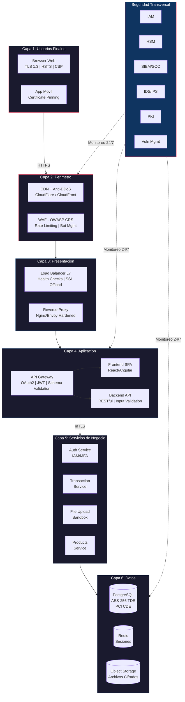
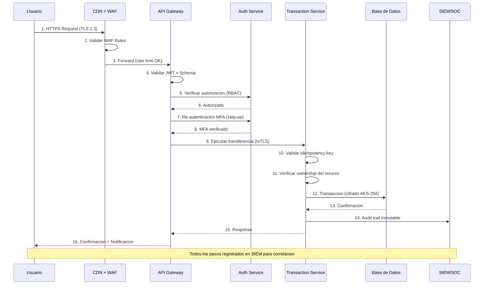
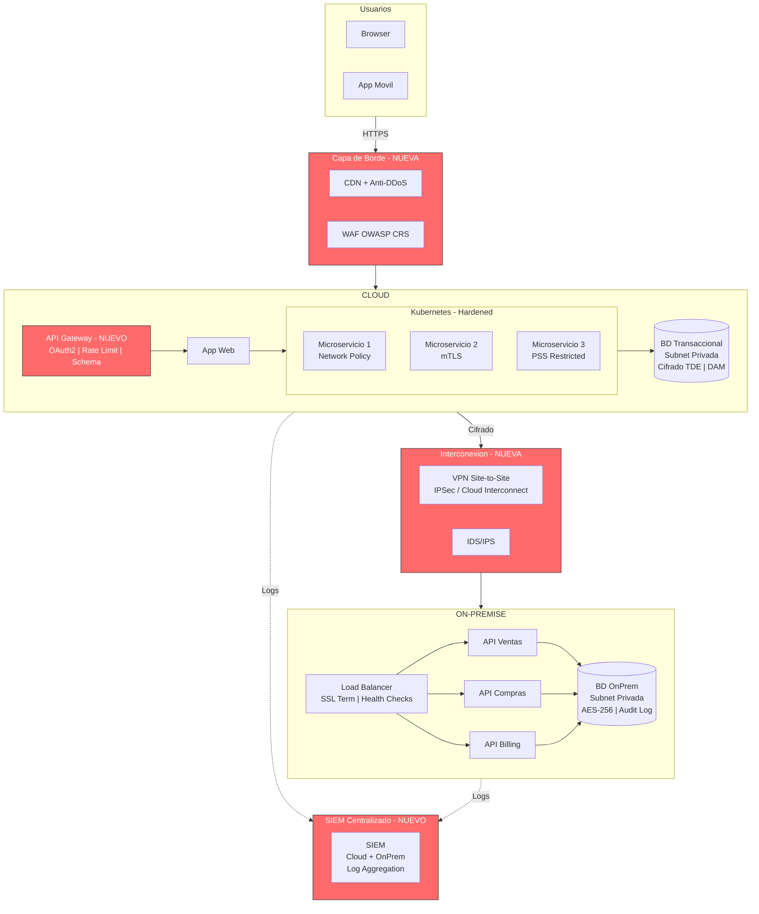
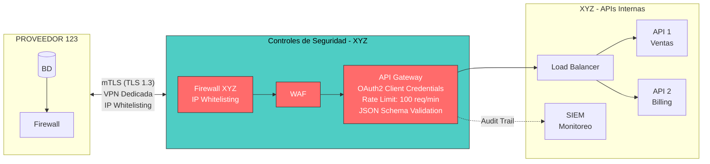
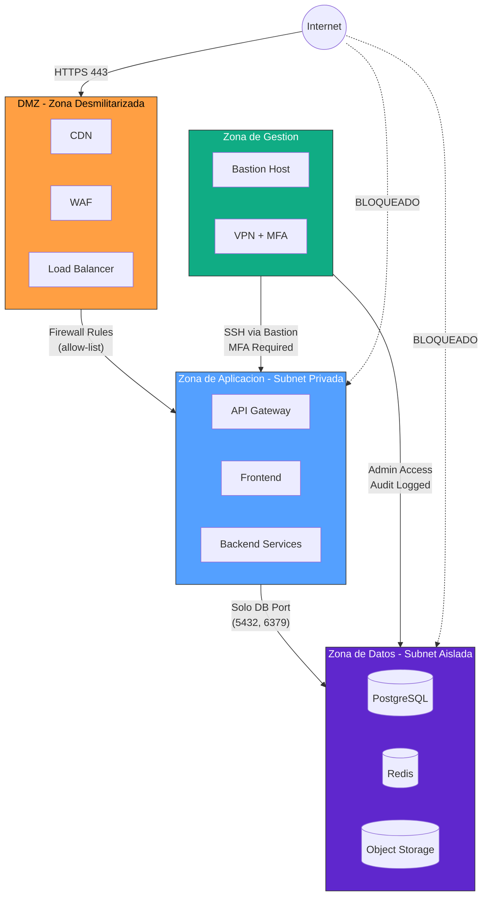

# Diagramas de Arquitectura - Portal Financiero XYZ

## 1. Arquitectura de Defensa en Profundidad

## 2. Flujo de Transaccion Bancaria Segura

## 3. Arquitectura Cloud + OnPremise (Mejorada)

## 4. Integracion API con Proveedor 123 (Arquitectura Mejorada)

## 5. Segmentacion de Red

